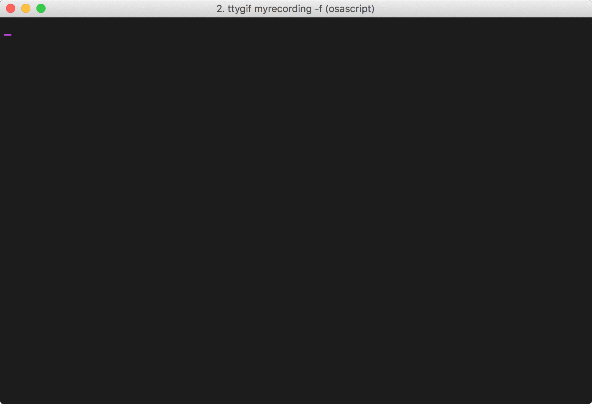

# PEbot
Geeky way to register PE class in SFC



## Installation
### macOS
NOTED: by default you can only run Chrome headlessly on Ubuntu

install [Chrome](https://www.google.com/chrome/browser/desktop/index.html) and ChromeDriver

```
brew install chromedriver
```

then

```
pip3 install -e .
```
### Ubuntu
install Chrome

```
wget https://dl.google.com/linux/direct/google-chrome-stable_current_amd64.deb
sudo dpkg -i google-chrome*.deb
sudo apt-get install -f
```

install **xvfb** so we can run Chrome headlessly

```
sudo apt-get install xvfb
```

install ChromDriver, you can find latest ChromeDriver release [here](https://sites.google.com/a/chromium.org/chromedriver/downloads)

```
wget http://chromedriver.storage.googleapis.com/2.25/chromedriver_linux64.zip
sudo apt-get install unzip
unzip chromedriver_linux64.zip
chmod +x chromedriver
```

add `chromedriver` to `$PATH`

```
sudo mv -f chromedriver /usr/local/share/chromedriver
sudo ln -s /usr/local/share/chromedriver /usr/local/bin/chromedriver
sudo ln -s /usr/local/share/chromedriver /usr/bin/chromedriver
```

finally

```
pip3 install -e .
```
## Usage

```
pecli --help
```

## TODOs
- [ ] Provide Python2 compatibility 
- [x] Optimize CLI by using [Click](http://click.pocoo.org/5/)
- [x] Provide available courses list
- [ ] Handle Exceptions
